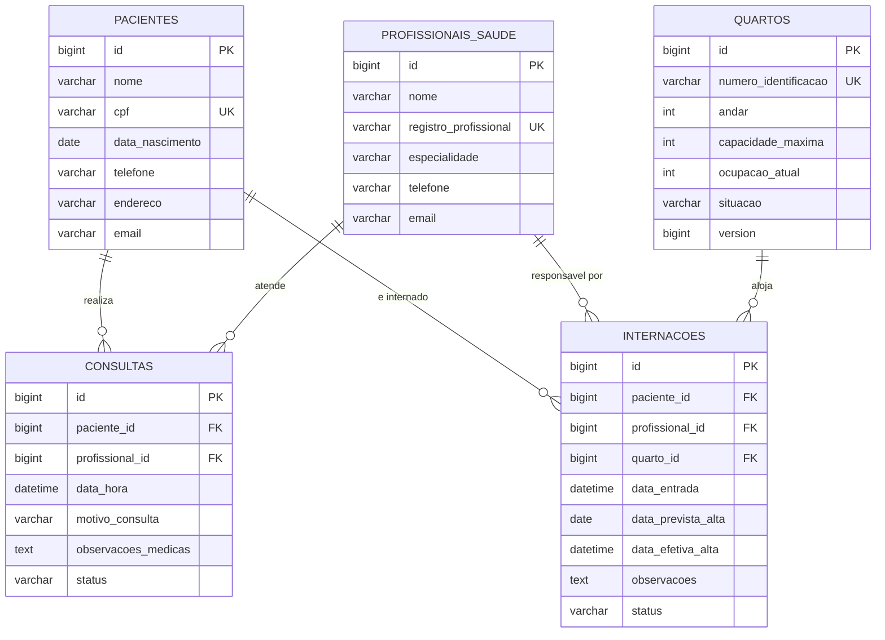

# Banco de Dados, Persistência e Qualidade de Código

Documentação da parte de **Bernardo**: configuração do banco, mapeamento JPA/repositories,
tratamento global de erros e testes automatizados.

---

## 1. Banco escolhido: MySQL 8

| Critério | Motivo |
|---|---|
| Adequação | Sistema transacional com relacionamentos claros (paciente, profissional, quarto, consulta, internação): modelo relacional é o natural. |
| Integridade | Chaves estrangeiras, `UNIQUE` (CPF, registro profissional, número do quarto) e `NOT NULL` garantidas pelo próprio banco, além das validações da aplicação. |
| Praticidade | Já instalado nas máquinas do grupo; o MySQL Workbench facilita conferir os dados. |
| Alternativa sem instalação | Perfil `h2` (banco em memória) permite rodar o projeto e os testes em qualquer máquina. |

O H2 em memória **substitui** o antigo banco do projeto apenas nos testes e no perfil `h2`;
a execução normal agora grava no MySQL.

## 2. Como configurar

### 2.1 Criar o banco (uma vez por máquina)

Abra `docs/sql/01_criar_banco.sql` no MySQL Workbench, conecte-se ao servidor local
(Database → Connect to Database) e execute o script inteiro (ícone do raio). Ele cria:

- o banco `hospitaldb` (UTF-8, `utf8mb4`);
- o usuário `hospital_app` com a senha `hospital123` e permissão **somente** sobre `hospitaldb`.

> Credenciais de **desenvolvimento**. Para outro ambiente, não edite o `application.properties`:
> defina variáveis de ambiente.

### 2.2 Variáveis de ambiente (opcionais)

| Variável | Padrão | Uso |
|---|---|---|
| `DB_HOST` | `localhost` | Servidor MySQL |
| `DB_PORT` | `3306` | Porta |
| `DB_NAME` | `hospitaldb` | Nome do banco |
| `DB_USER` | `hospital_app` | Usuário |
| `DB_PASSWORD` | `hospital123` | Senha |
| `DDL_AUTO` | `update` | Estratégia do Hibernate (`update`, `validate`, `none`...) |
| `SHOW_SQL` | `false` | Mostra as consultas SQL no console |

### 2.3 Executar

```powershell
# Com MySQL (padrão)
.\mvnw.cmd spring-boot:run

# Sem MySQL (banco em memória, zerado a cada execução)
.\mvnw.cmd spring-boot:run "-Dspring-boot.run.profiles=h2"
```

No perfil `h2`, o console do banco fica em `http://localhost:8080/h2-console`
(JDBC URL `jdbc:h2:mem:hospitaldb`, usuário `sa`, senha vazia).

Para conferir as tabelas no MySQL Workbench: `USE hospitaldb; SHOW TABLES;`.

## 3. Modelo de dados



### Decisões de projeto

- **Histórico médico não tem tabela própria.** Ele é *derivado*: reúne as consultas e as
  internações do paciente (`HistoricoMedicoService`). Evita duplicar dados e inconsistências.
- **Enums gravados como texto** (`@Enumerated(EnumType.STRING)`): o banco fica legível e
  reordenar o enum no código não corrompe dados antigos.
- **Controle de concorrência otimista (`@Version` em `Quarto`).** Se duas internações tentarem
  ocupar o último leito ao mesmo tempo, a segunda falha em vez de estourar a capacidade.
  A API responde `409 Conflict`.
- **Índices** para as consultas mais frequentes:
  - `idx_consulta_profissional_data (profissional_id, data_hora)`: verificação de choque de horário;
  - `idx_internacao_paciente_status (paciente_id, status)`: "paciente já está internado?";
  - `idx_internacao_quarto_status (quarto_id, status)`: internações ativas de um quarto.
- **`spring.jpa.open-in-view=false`**: a conexão com o banco é liberada ao fim da camada de
  serviço, evitando consultas "escondidas" durante a serialização do JSON.
- **`ddl-auto=update`**: o Hibernate cria/ajusta as tabelas automaticamente, adequado ao
  projeto acadêmico. Em produção o ideal seria `validate` + migrações (Flyway).

## 4. Repositories

Além dos métodos já usados pelos services, foram adicionadas consultas ordenadas e de apoio:

| Repository | Consultas adicionadas |
|---|---|
| `PacienteRepository` | `findByNomeContainingIgnoreCaseOrderByNomeAsc` |
| `ProfissionalSaudeRepository` | `findByEspecialidadeIgnoreCaseOrderByNomeAsc` |
| `QuartoRepository` | `findByAndarOrderByNumeroIdentificacaoAsc`, `findComVagaDisponivel` (JPQL) |
| `InternacaoRepository` | `findByPacienteIdOrderByDataEntradaDesc`, `findFirstByPacienteIdAndStatus`, `countByQuartoIdAndStatus` |
| `ConsultaRepository` | `findByPacienteIdOrderByDataHoraDesc`, `findByProfissionalIdOrderByDataHoraAsc`, `findByDataHoraBetweenOrderByDataHoraAsc`; a consulta `findConflitoHorarioProfissional` (choque de horário) foi mantida |

## 5. Tratamento global de erros

`GlobalExceptionHandler` (`@RestControllerAdvice`) transforma qualquer exceção em um JSON padronizado:

```json
{
  "timestamp": "2026-10-08T23:58:40.123",
  "status": 409,
  "error": "Conflito de regra de negócio",
  "message": "O quarto 101-A atingiu sua capacidade máxima (1 leitos).",
  "path": "/internacoes",
  "errors": { "campo": "mensagem" }
}
```

(`errors` só aparece em erros de validação de campos.)

| Situação | HTTP |
|---|---|
| Recurso não encontrado (`RecursoNaoEncontradoException`) ou rota inexistente | **404** |
| Regra de negócio violada (`RegraNegocioException`: CPF duplicado, data no passado, alta repetida...) | **400** |
| Campos inválidos (`@Valid`), JSON malformado, parâmetro com tipo errado (`/pacientes/abc`) | **400** |
| Choque de horário (`ChoqueHorarioException`) | **409** |
| Quarto lotado (`QuartoLotadoException`) | **409** |
| Violação de integridade do banco, conflito de concorrência (`@Version`) | **409** |
| Método HTTP não permitido | **405** |
| `Content-Type` não suportado | **415** |
| Qualquer erro inesperado | **500** (mensagem genérica; o detalhe só vai para o log) |

> **Mudança em relação à versão anterior:** choque de horário e quarto lotado passaram de
> `400` para `409`, pois a requisição é válida, mas conflita com o estado atual dos dados.
> Quem consome a API (front-end) deve tratar o código 409 além do 400.

## 6. Testes automatizados

Executar todos: `.\mvnw.cmd test`. Total: **115 testes**.

| Pacote | Tipo | Testes | O que cobre |
|---|---|---|---|
| `servicos` | Unitário (Mockito) | 24 | Regras de negócio dos services (já existentes) |
| `repositorios` | `@DataJpaTest` (H2 isolado) | 31 | Consultas derivadas e JPQL, choque de horário (limites da janela de 29 min, cancelada ignorada), unicidade, `@Version` |
| `controladores` | `@WebMvcTest` + `@MockBean` | 35 | Rotas, códigos HTTP e validação de entrada de cada controller |
| `excecoes` | `@WebMvcTest` | 15 | Cada tipo de erro vira o status e o JSON corretos; 500 não vaza mensagem interna |
| `integracao` | `@SpringBootTest` + MockMvc (perfil `h2`) | 10 | Fluxos completos pela API: agendar/cancelar/finalizar consultas, janela de conflito, internação, lotação do quarto, alta liberando o leito, histórico, duplicidades, lock otimista |

Os testes **não dependem do MySQL**: usam H2 em memória, então rodam em qualquer máquina e no CI.
