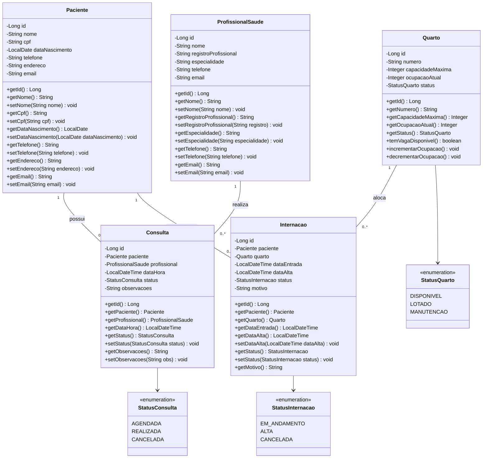
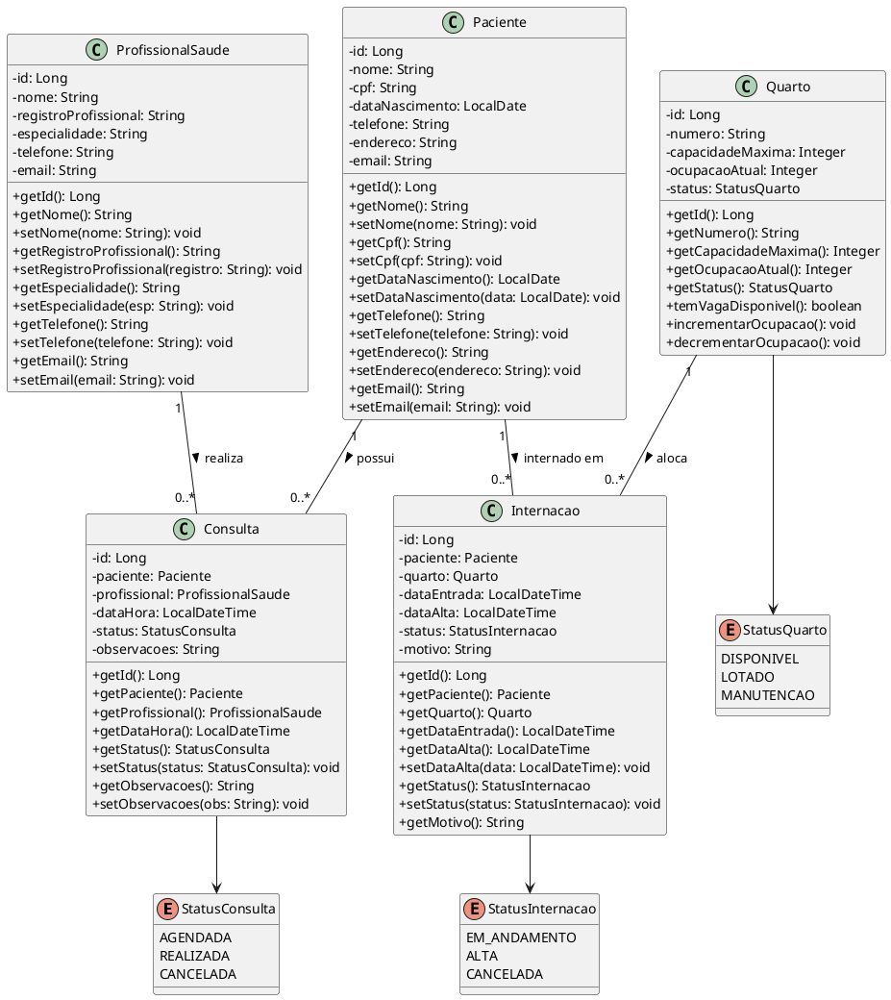

# Diagrama de Classes — Sprint 1

Trabalho Prático de Programação Modular — Sistema de Informação Hospitalar  
Curso de Engenharia de Software — PUC Minas

---

## 📊 Diagrama Visual (Mermaid)

---

## 📝 Código PlantUML

---

## 📌 Detalhamento dos Relacionamentos e Multiplicidades

1. **Paciente — Consulta (1 para 0..*)**:
   * Um `Paciente` pode ter 0 ou várias consultas registradas em seu histórico.
   * Toda `Consulta` pertence obrigatoriamente a exatamente 1 paciente.

2. **ProfissionalSaude — Consulta (1 para 0..*)**:
   * Um `ProfissionalSaude` pode atender 0 ou várias consultas ao longo do tempo.
   * Toda `Consulta` é conduzida por exatamente 1 profissional responsável.

3. **Paciente — Internacao (1 para 0..*)**:
   * Um `Paciente` pode possuir 0 ou mais internações no seu histórico clínico.
   * Cada registro de `Internacao` refere-se a exatamente 1 paciente.

4. **Quarto — Internacao (1 para 0..*)**:
   * Um `Quarto` pode receber múltiplas internações ao longo de sua vida útil, respeitando a capacidade máxima simultânea (`ocupacaoAtual <= capacidadeMaxima`).
   * Cada `Internacao` está associada a exatamente 1 quarto.
